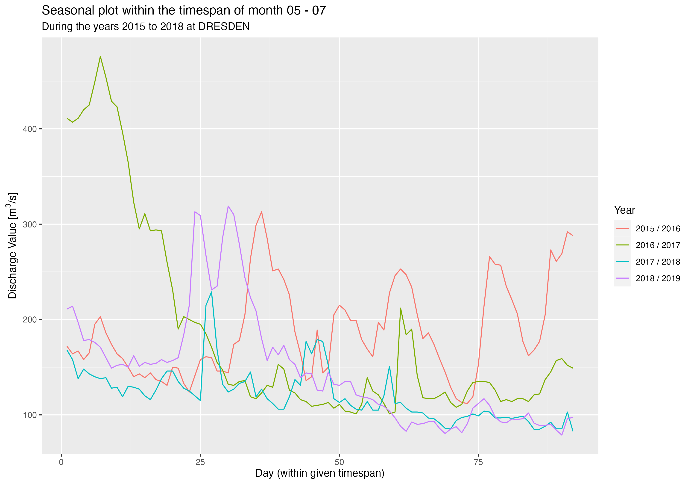
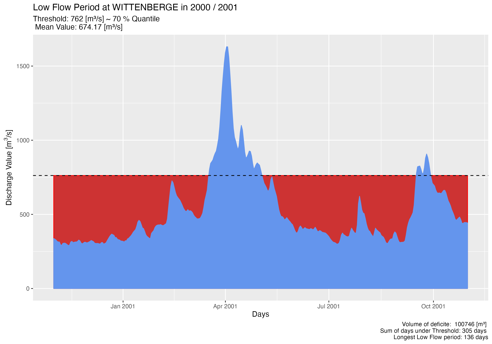

# lfanalyse

This R-package was developed to enable an easy access to a statistical
discharge analysis. By combining the read-in, ordering and analysis
functions, it is intended to simplify the workflow and serve as a useful
tool to bundle several steps of the analysis. By the fact that the
functions are co-ordinated with each other, a smooth workflow is to be
made possible.

## Installation

You can install the development version of dischanalyst from
[GitHub](https://github.com/) with:

``` r
# install.packages("devtools")
devtools::install_github("maibrittbergh/lfanalyse")
```

## Workflow

*lfanalyse* can be applied to the GRDC
(<https://www.bafg.de/GRDC/EN/Home/homepage_node.html>) data set or to
hydrological and climatological time series corresponding to the
structure of the GRDC discharge measurement series. Accordingly, a date
(YYYY-MM-DD) must be available for each daily measured value. As soon as
a data set of this structure is available, it can be read in, structured
and analyzed with the help of *lfanalyse*.

## Structure

### 1. Functions to load and structure the dataset

### 2. Functions for the descriptive statistical analysis

<figure>

<figcaption aria-hidden="true">Seasonplot</figcaption>
</figure>

### 3. Functions for a threshold based low flow analysis (quantile based/numerical)

<figure>

<figcaption aria-hidden="true">Threshold based analysis</figcaption>
</figure>

### 4. Functions to determine discharge trends

<figure>

<figcaption aria-hidden="true">Trendplot</figcaption>
</figure>

## Results

Possible Outcomes are visualized on the *Low Flow Analysis*
[WebApp](https://github.com/maibrittbergh/lfwebapp). This Shiny Web App
is linked to this R-package and visualizes the results of the low flow
analysis. The goal of the Web App was to create a tool that enables
every interested person to analyse discharge data without having access
to [R](https://www.r-project.org/). Thanks to the extensive
[grdc](https://www.bafg.de/GRDC/EN/Home/homepage_node.html) data set a
worldwide statistical analysis is possible. Every result can be
downloaded directly from the Website. In order to obtain meaningful
results, a holistic approach to the analysis is necessary. To explain or
understand possible trends it is important to look at the descriptive
graphs of that station (or additionally stations of the same catchement
area). This holistic approach might explain trends or allow conclusions
that constructions/anthropogenic interventions might have influenced the
local/regional discharge trends on a short or long time scale. Therefore
it is important to keep in mind that the generated results are
influenced by many parameters of the environment and they cannot
necessarily be explained by a changing climate. To further establish the
link between the resulting trends and the changing climate it would be
required to include a statistical analysis of precipitation and
temperature time series.

## Statistical Manual

This manual was created to create transparent results and to explain the
concepts that this analysis is build on. This manual can be seen as a
guide to statistical time series analysis and discusses the different
approaches of this project.
